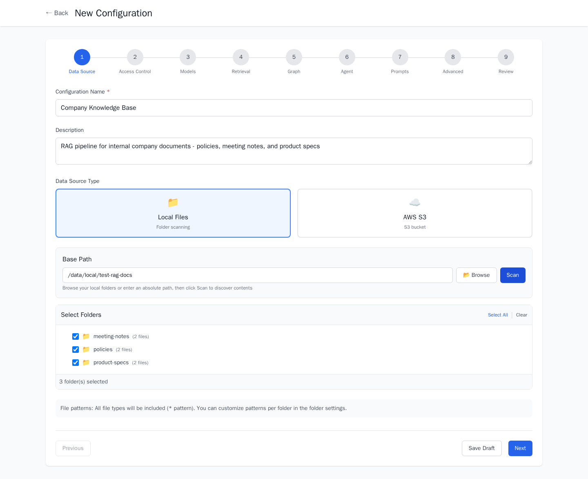
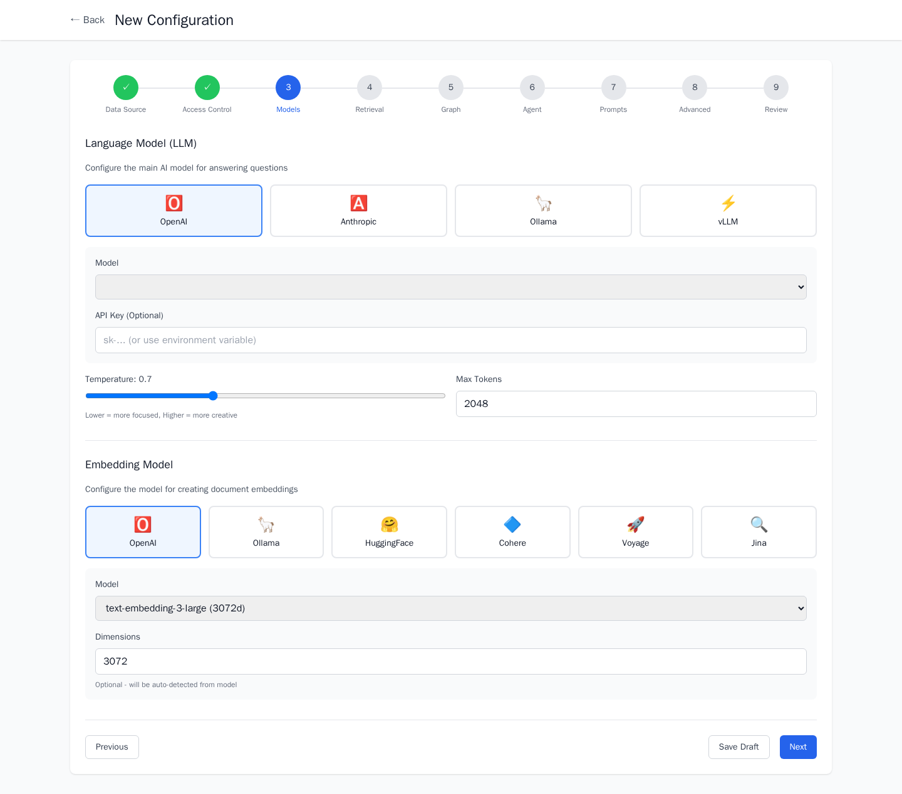
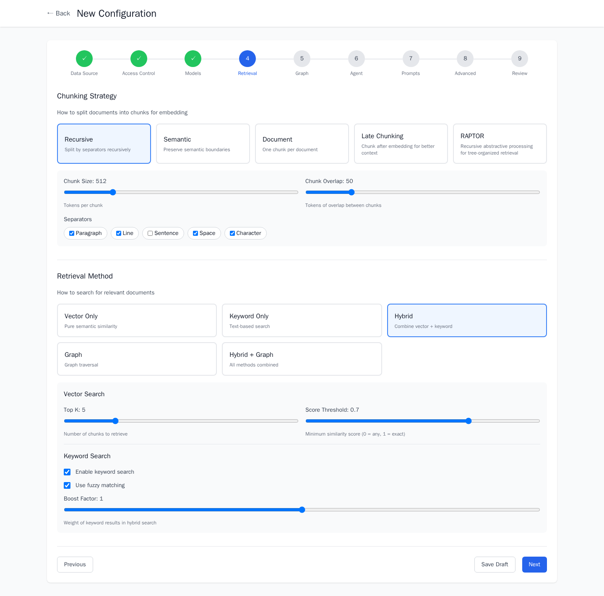
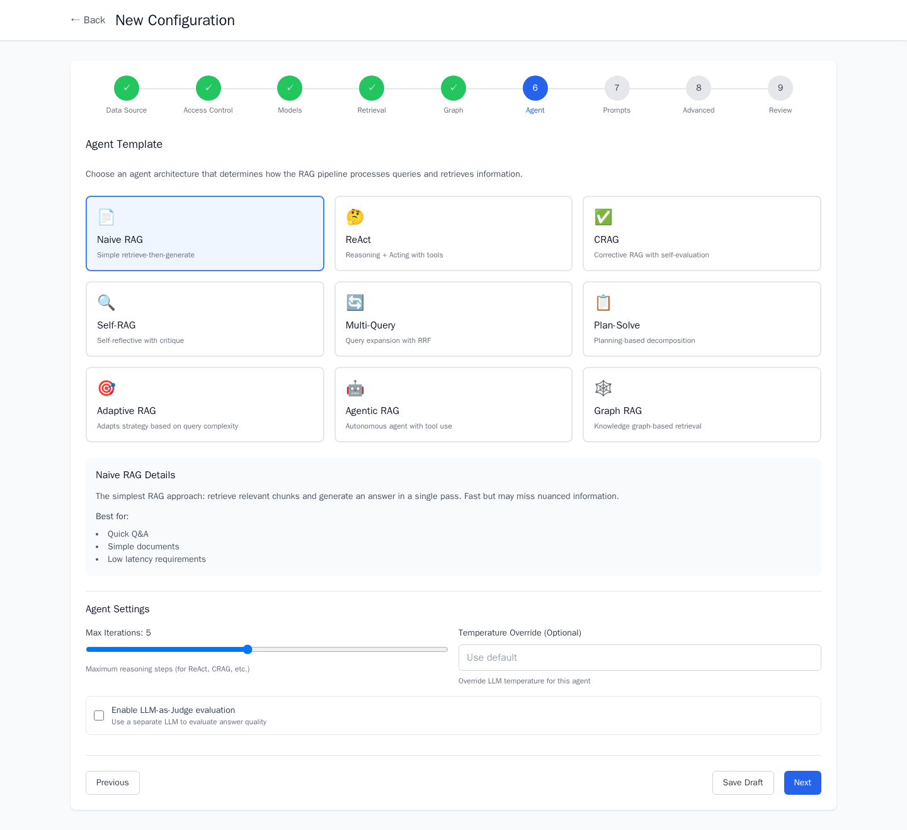
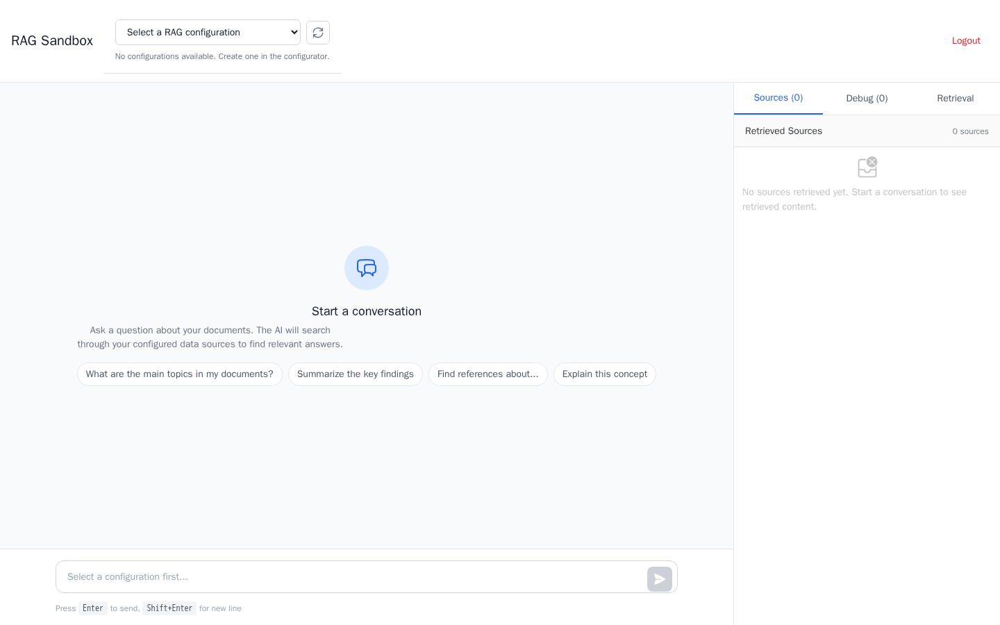
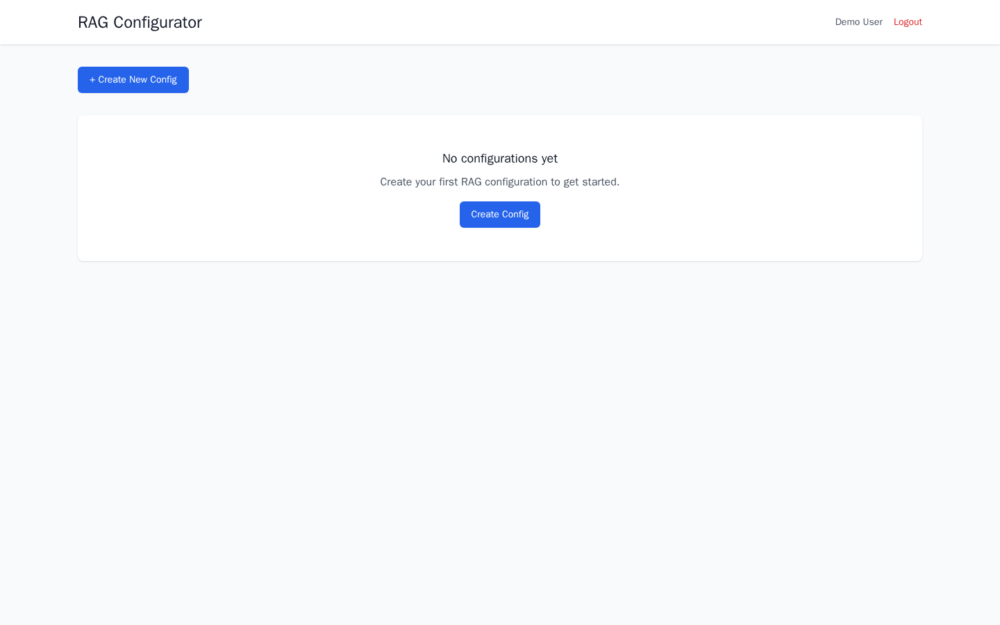

# RAG Configurator

**A full-stack platform for building, configuring, and deploying custom RAG (Retrieval-Augmented Generation) pipelines through a visual interface — no code required.**

Design your retrieval strategy, pick your LLM, ingest documents, and chat with your knowledge base — all from the browser.

---

## Screenshots

### Configuration Wizard — Data Source


*Browse local folders or S3 buckets, scan for documents, and select which directories to ingest.*

### Configuration Wizard — Model Selection


*Choose from 4 LLM providers (OpenAI, Anthropic, Ollama, vLLM) and 6 embedding providers. Configure temperature, max tokens, and model-specific parameters.*

### Configuration Wizard — Retrieval Strategy


*Select chunking strategy (Recursive, Semantic, Document, Late Chunking, RAPTOR), retrieval method (Vector, Keyword, Hybrid, Graph), and fine-tune search parameters.*

### Configuration Wizard — Agent Architecture


*Pick from 9 agent architectures — from simple Naive RAG to sophisticated Adaptive RAG, CRAG, and Graph RAG. Each shows use cases and configurable parameters.*

### Sandbox — Chat Interface


*Real-time SSE streaming chat with source citations. Right panel shows retrieved chunks with relevance scores and a retrieval debug panel.*

### Dashboard


*Manage all your RAG configurations. Create, edit, delete, and jump into the sandbox to test.*

---

## Highlights

- **Visual Pipeline Builder** — 9-step wizard to configure chunking, embedding, retrieval, and generation
- **9 Agent Architectures** — Naive RAG, ReAct, CRAG, Self-RAG, Multi-Query, Plan-and-Solve, Adaptive, Agentic, Graph RAG
- **4 LLM Providers** — OpenAI, Anthropic, Ollama (local GPU), vLLM (self-hosted)
- **6 Embedding Providers** — OpenAI, Ollama, HuggingFace, Cohere, Voyage, Jina
- **Hybrid Retrieval** — Vector, keyword, graph, and hybrid search with re-ranking
- **Real-time Chat** — SSE streaming responses with source citations
- **Local File Browsing** — Mount and browse host folders directly from the UI for document ingestion
- **Async Ingestion** — Celery workers process documents in the background with live progress tracking
- **Multi-tenant Auth** — JWT authentication with role-based access control
- **Full Local Mode** — Run entirely on your own hardware with Ollama, no cloud APIs required
- **Jev vs LLM judges** — Compare TypeSafe Jev and LLM-as-judge on frozen RAG traces (`make jev-eval-compare`)

---

## Architecture

```
                        ┌──────────────────────────────────┐
                        │         Client Layer              │
                        │  Configurator UI  │  Sandbox UI   │
                        │    (Vue 3)        │   (Vue 3)     │
                        └────────┬─────────────┬────────────┘
                                 │             │
                        ┌────────▼─────────────▼────────────┐
                        │     API Gateway (Go + Gin)         │
                        │  JWT Auth · Rate Limiting · CORS   │
                        │  Reverse Proxy · SSE Streaming     │
                        └──┬──────────┬──────────┬──────────┘
                           │          │          │
              ┌────────────▼┐  ┌──────▼───────┐  ┌▼────────────────┐
              │ Config       │  │ Ingestion    │  │ RAG Service     │
              │ Service      │  │ Service      │  │ (LangGraph)     │
              │ (FastAPI)    │  │ (FastAPI)    │  │ (FastAPI)       │
              │              │  │              │  │                 │
              │ • Users/Auth │  │ • Processors │  │ • Retrievers    │
              │ • Config CRUD│  │ • Chunkers   │  │ • LLM Clients   │
              │ • Folder API │  │ • Embedders  │  │ • 9 Agent Types │
              │ • RBAC       │  │ • Celery     │  │ • SSE Streaming │
              └──────┬───────┘  └──────┬───────┘  └──────┬──────────┘
                     │                 │                  │
              ┌──────▼─────────────────▼──────────────────▼──────┐
              │                   Data Layer                      │
              │  MongoDB 7.0        │  Redis 7                   │
              │  • Configs & Users  │  • Celery Broker           │
              │  • Chunks & Vectors │  • Task Results            │
              │  • Ingestion State  │  • Session Cache           │
              └──────────────────────────────────────────────────┘
```

### Services

| Service | Tech | Port | Role |
|---------|------|------|------|
| **Gateway** | Go 1.24, Gin | 8000 | Auth, routing, rate-limiting, SSE proxy |
| **Config Service** | Python 3.11, FastAPI | 8001 | User management, pipeline configs, folder browsing |
| **Ingestion Service** | Python 3.11, FastAPI, Celery | 8002 | Document parsing, chunking, embedding |
| **RAG Service** | Python 3.11, FastAPI, LangGraph | 8003 | Retrieval, generation, agent orchestration |
| **Configurator UI** | Vue 3, TypeScript, Vite | 5173 | Pipeline configuration wizard |
| **Sandbox UI** | Vue 3, TypeScript, Vite | 3001 | Chat interface for testing pipelines |
| **MongoDB** | 7.0 | 27017 | Primary datastore + vector search |
| **Redis** | 7-alpine | 6379 | Task queue broker + caching |

---

## RAG Capabilities

### Agent Architectures

| Agent | Description |
|-------|-------------|
| **Naive RAG** | Retrieve → Generate. Simple and fast baseline. |
| **ReAct** | Reasoning + Acting loop with tool use for complex queries |
| **Corrective RAG (CRAG)** | Evaluates retrieval quality, self-corrects with query rewriting |
| **Self-RAG** | Iterative self-reflection — generates, critiques, and refines |
| **Multi-Query** | Expands user query into multiple perspectives, parallel retrieval |
| **Plan-and-Solve** | Decomposes complex questions into sub-tasks, solves step-by-step |
| **Adaptive RAG** | Automatically selects strategy based on query complexity |
| **Agentic RAG** | Autonomous agent with tool use for open-ended exploration |
| **Graph RAG** | Knowledge graph-based retrieval for connected, relational data |

### Retrieval Methods

| Method | Description |
|--------|-------------|
| **Vector Search** | Semantic similarity via cosine distance |
| **Keyword Search** | Full-text search with fuzzy matching |
| **Hybrid Search** | Reciprocal Rank Fusion of vector + keyword results |
| **Graph Search** | Entity-relationship traversal for connected knowledge |
| **Hybrid + Graph** | All methods combined for maximum recall |

### Chunking Strategies

| Strategy | Description |
|----------|-------------|
| **Recursive** | Recursive character splitting with configurable overlap |
| **Semantic** | Embedding-based boundary detection for coherent chunks |
| **Document** | Preserves document structure as single chunks |
| **Late Chunking** | Chunk after embedding for better context preservation |
| **RAPTOR** | Recursive abstractive processing for tree-organized retrieval |

### LLM Providers

| Provider | Models |
|----------|--------|
| **OpenAI** | GPT-4o, GPT-4o Mini, GPT-4 Turbo, GPT-3.5 Turbo |
| **Anthropic** | Claude 3.5 Sonnet, Claude 3 Opus, Claude 3 Haiku |
| **Ollama** | Llama 3, Mistral, Qwen, Phi — any GGUF model (local, GPU) |
| **vLLM** | Any HuggingFace model via vLLM server |

### Embedding Providers

| Provider | Models |
|----------|--------|
| **OpenAI** | text-embedding-3-small, text-embedding-3-large, ada-002 |
| **Ollama** | nomic-embed-text, all-minilm, mxbai-embed-large (local) |
| **HuggingFace** | Any sentence-transformers model (local) |
| **Cohere** | embed-english-v3.0, embed-multilingual-v3.0 |
| **Voyage** | voyage-3, voyage-3-lite |
| **Jina** | jina-embeddings-v3 |

---

## Quick Start

### Prerequisites

- **Docker Desktop** (with Docker Compose v2)
- **Ollama** (optional, for local LLM — [install here](https://ollama.com))

### 1. Clone and configure

```bash
git clone https://github.com/ozkannceylan/rag-configurator.git
cd rag-configurator
cp .env.example .env
```

Edit `.env` — at minimum set:

```env
# For local LLM (Ollama)
OLLAMA_BASE_URL=http://host.docker.internal:11434

# To browse local folders from the UI
LOCAL_DATA_PATH=/path/to/your/documents
```

### 2. Pull Ollama models (if using local LLM)

```bash
ollama pull qwen3:4b          # or any chat model
ollama pull nomic-embed-text   # embedding model
```

### 3. Start all services

```bash
docker compose up -d
```

This starts 11 containers: gateway, 3 backend services, celery worker, 2 frontend apps, MongoDB, Redis, and dev tools (Mongo Express, Redis Commander).

### 4. Create a demo user

```bash
# Linux/macOS
./demo/scripts/seed-demo.sh

# Windows PowerShell
./create_demo_user.ps1
```

### 5. Open the UI

| URL | Description |
|-----|-------------|
| http://localhost:5173 | **Configurator UI** — Create and manage RAG pipelines |
| http://localhost:3001 | **Sandbox UI** — Chat with your configured pipelines |
| http://localhost:8081 | **Mongo Express** — Browse database (dev) |
| http://localhost:8082 | **Redis Commander** — Inspect queues (dev) |

### First Steps

1. Log in at `http://localhost:5173`
2. Click **New Configuration** → follow the 9-step wizard
3. Set a data source path → **Browse** your local folders or use the included sample docs
4. Configure models, retrieval, and agent settings
5. Click **Scan** → select folders → save the config
6. Start document ingestion from the config detail page
7. Once ingestion completes, open `http://localhost:3001` → select your config → start chatting

---

## Tech Stack

### Backend

| | Technology | Purpose |
|---|---|---|
| **Language** | Go 1.24 | API Gateway |
| **Language** | Python 3.11 | All microservices |
| **Web Framework** | FastAPI 0.111 | REST APIs with async support |
| **Agent Framework** | LangGraph 0.2 | Stateful agent orchestration |
| **LLM Libraries** | LangChain, langchain-openai, langchain-anthropic | LLM provider abstraction |
| **Task Queue** | Celery 5.4 + Redis | Async document ingestion |
| **Database** | MongoDB 7.0 + Motor 3.4 | Async document store + vector index |
| **Auth** | JWT (python-jose, golang-jwt/v5) | Stateless authentication |
| **Validation** | Pydantic 2.x | Schema validation across all services |
| **HTTP Router** | Gin 1.10 | High-performance Go HTTP framework |
| **Doc Parsing** | Docling, PyMuPDF, python-docx | PDF, DOCX, HTML, TXT, MD |
| **OCR** | pytesseract + Pillow | Scanned document extraction |
| **Embeddings** | OpenAI, Ollama, sentence-transformers | Multiple embedding providers |
| **Streaming** | sse-starlette | Server-Sent Events for real-time chat |
| **Observability** | Langfuse, OpenTelemetry | LLM tracing and metrics |

### Frontend

| | Technology | Purpose |
|---|---|---|
| **Framework** | Vue 3.4 (Composition API) | Reactive UI |
| **Language** | TypeScript 5.4 | Type-safe frontend code |
| **Build** | Vite 5.2 | Fast dev server + production builds |
| **State** | Pinia 2.1 | Centralized state management |
| **Styling** | Tailwind CSS 3.4 | Utility-first CSS |
| **Components** | Headless UI 1.7, Naive UI | Accessible UI primitives |
| **Icons** | Heroicons 2.1 | SVG icon set |

### Infrastructure

| | Technology | Purpose |
|---|---|---|
| **Containers** | Docker + Docker Compose | Service orchestration (11 containers) |
| **Database** | MongoDB 7.0 | Document store + vector search |
| **Cache/Queue** | Redis 7 | Celery broker + result backend + caching |
| **Reverse Proxy** | Nginx | Production routing + TLS termination |

---

## Project Structure

```
rag-configurator/
├── gateway/                        # Go API Gateway
│   ├── cmd/server/                 #   Entrypoint
│   └── internal/
│       ├── middleware/             #   JWT auth, CORS, rate-limit
│       ├── router/                #   Route definitions
│       └── proxy/                 #   Reverse proxy + SSE support
│
├── services/
│   ├── config-service/             # Python — Config & Auth
│   │   └── app/
│   │       ├── api/v1/             #   REST endpoints
│   │       ├── services/           #   Business logic
│   │       ├── schemas/            #   Pydantic models
│   │       └── db/                 #   MongoDB repositories
│   │
│   ├── ingestion-service/          # Python — Document Processing
│   │   └── app/
│   │       ├── processors/         #   PDF, DOCX, TXT, MD, HTML parsers
│   │       ├── chunkers/           #   Recursive, Semantic, Document
│   │       ├── embedders/          #   OpenAI, Ollama, HuggingFace
│   │       └── tasks/              #   Celery async tasks
│   │
│   └── rag-service/                # Python — RAG Runtime
│       └── app/
│           ├── agents/             #   9 agent architectures (LangGraph)
│           ├── retrieval/          #   Vector, Keyword, Hybrid, Graph
│           ├── llm/                #   OpenAI, Anthropic, Ollama, vLLM clients
│           └── api/v1/             #   Query + SSE stream endpoints
│
├── apps/
│   ├── configurator-ui/            # Vue 3 — Pipeline Configuration Wizard
│   └── sandbox-ui/                 # Vue 3 — Chat Testing Interface
│
├── shared/
│   ├── python/                     # Shared Pydantic models (rag_config_common)
│   └── typescript/                 # Shared TypeScript interfaces
│
├── demo/
│   ├── sample-docs/                # Example documents for testing
│   ├── sample-configs/             # Pre-built pipeline configurations
│   └── scripts/                    # Seeding and demo setup scripts
│
├── infrastructure/                 # MongoDB init scripts, Nginx config
├── docker-compose.yml              # Full development stack (11 containers)
└── .env.example                    # Environment variable template
```

---

## Development

### Local Setup (without Docker)

**Prerequisites**: Python 3.11+, Node.js 20+, Go 1.24+, MongoDB 7.0+, Redis 7+

```bash
# Install shared package first (required before any Python service)
pip install -e shared/python

# Backend services
pip install -r services/config-service/requirements.txt
pip install -r services/ingestion-service/requirements.txt
pip install -r services/rag-service/requirements.txt

# Gateway
cd gateway && go mod download && cd ..

# Frontend
cd apps/configurator-ui && npm install && cd ../..
cd apps/sandbox-ui && npm install && cd ../..

# Start infrastructure only
docker compose up -d mongodb redis

# Run services individually in separate terminals
cd services/config-service && uvicorn app.main:app --port 8001 --reload
cd services/ingestion-service && uvicorn app.main:app --port 8002 --reload
cd services/rag-service && uvicorn app.main:app --port 8003 --reload
cd gateway && go run cmd/server/main.go
cd apps/configurator-ui && npm run dev
cd apps/sandbox-ui && npm run dev
```

### Testing

```bash
# All tests
make test

# Per-service
cd services/config-service && python -m pytest tests/ -v
cd services/ingestion-service && python -m pytest tests/ -v
cd services/rag-service && python -m pytest tests/ -v
cd gateway && go test ./... -v

# Jev vs LLM-as-judge on frozen RAG traces (offline mock, no API keys)
make jev-eval-compare
```

---

## Configuration

All settings are managed through `.env`. Key variables:

| Variable | Default | Description |
|----------|---------|-------------|
| `OLLAMA_BASE_URL` | `http://host.docker.internal:11434` | Native local Ollama (`/api/chat`) |
| `OLLAMA_API_KEY` | — | Ollama Cloud key for live LLM-as-judge (`https://ollama.com/v1`) |
| `LOCAL_DATA_PATH` | `.` | Host folder mounted into containers for browsing |
| `OPENAI_API_KEY` | — | OpenAI API key (if using OpenAI models) |
| `ANTHROPIC_API_KEY` | — | Anthropic API key (if using Claude) |
| `TYPESAFE_API_KEY` | — | TypeSafe Jev key for `evaluator_type=jev` and live compare |
| `JWT_SECRET_KEY` | (dev default) | **Change in production** |
| `MONGODB_URI` | `mongodb://localhost:27017` | MongoDB connection string |
| `REDIS_URL` | `redis://localhost:6379/0` | Redis connection string |

See [.env.example](.env.example) for the full list.

---

## API Overview

All endpoints are served through the gateway at `http://localhost:8000/api/v1/`.

| Method | Endpoint | Description |
|--------|----------|-------------|
| `POST` | `/auth/register` | Register new user |
| `POST` | `/auth/login` | Login, returns JWT |
| `GET` | `/configs` | List pipeline configurations |
| `POST` | `/configs` | Create a new pipeline config |
| `GET` | `/configs/:id` | Get config details |
| `PUT` | `/configs/:id` | Update configuration |
| `DELETE` | `/configs/:id` | Delete configuration |
| `POST` | `/folders/browse` | Browse server-side folders |
| `POST` | `/folders/scan` | Scan folder for documents |
| `POST` | `/ingestion/start` | Start document ingestion |
| `GET` | `/ingestion/:id/status` | Get ingestion progress |
| `POST` | `/query` | Single-turn RAG query |
| `POST` | `/stream` | SSE streaming chat |
| `POST` | `/evaluation/evaluate` | RAGAS, LLM-judge, quality, or Jev evaluation |
| `GET` | `/evaluation/jev-compare/latest` | Last Jev vs LLM compare summary |

---

## License

[Apache License 2.0](LICENSE)

---

## Acknowledgments

Built with [FastAPI](https://fastapi.tiangolo.com), [LangGraph](https://github.com/langchain-ai/langgraph), [Vue 3](https://vuejs.org), [Gin](https://gin-gonic.com), [MongoDB](https://www.mongodb.com), [Ollama](https://ollama.com), and [Langfuse](https://langfuse.com).
