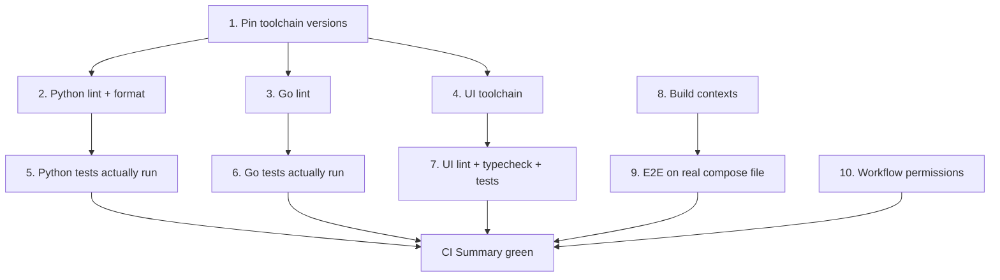

# CI Recovery Plan — why everything is red, and how it goes green

Status: diagnosed 2026-09-21. Every workflow (CI, CD, Release) has failed on
`main` since well before the Jev work landed — run #3 (2026-04-08) was already
red. The Jev PR did not break CI; it merged into an already-red pipeline.

## Failure map

Last run on `main`: [35578015852](https://github.com/ozkannceylan/rag-configurator/actions/runs/35578015852)
— 18 jobs, 6 failed, the rest cancelled or skipped behind `needs:`.

| Job | Verdict | Root cause |
| --- | --- | --- |
| Python Lint | fails | 1,643 ruff violations + 75 black-unformatted files |
| Python Test | never runs | blocked by `needs: python-lint` |
| Go Lint | fails | 15 `errcheck` violations, 2 files fail `gofmt` |
| Go Test | never runs | blocked by `needs: go-lint`; tests pass locally |
| UI Lint | fails | `eslint: not found` — never installed, no config exists |
| UI Test | never runs | blocked by `needs: ui-lint`; no test files, no coverage provider |
| Docker Build Test | fails | wrong build context, Dockerfiles need repo root |
| E2E Integration | never runs | `docker-compose` v1 binary is gone from the runner |
| Security Scan | fails | SARIF upload lacks `security-events: write` |
| CI Summary | fails | aggregates the above |
| CD / build-images | fails | same wrong-context bug as Docker Build Test |
| CD / update-status | fails | commit-status API call lacks `statuses: write` |

## Root causes in detail

### 1. Python lint — 1,643 violations, zero of them new

Reproduced locally with the repo's own ruff config:

```
config-service       35 errors   (29 I001, 6 F401)
ingestion-service   670 errors   (351 UP006, 136 UP045, 72 UP035, ...)
rag-service         938 errors   (445 UP006, 248 UP045, 84 UP035, ...)
```

Plus `black --check`: 8 + 22 + 45 files would be reformatted.

The bulk (UP006 `List[x]` -> `list[x]`, UP045 `Optional[x]` -> `x | None`)
is typing modernization that ruff auto-fixes. The rule set was written into
`pyproject.toml` but never enforced, so violations accumulated for a year.

Three secondary problems in the same area:

- Ruff config uses the deprecated top-level `select` / `ignore` keys. Ruff
  already prints a deprecation warning; a future release turns it into an error.
- CI installs `ruff` and `black` unpinned. Every new ruff release can turn the
  build red without a commit. This is the reason CI drifts red on its own.
- CI runs `ruff format --check` **and** `black --check` over the same files.
  Two formatters competing for the same code is a standing conflict risk.

### 2. Go lint — 15 unchecked errors

`go build`, `go vet` and `go test ./...` all pass. Only golangci-lint fails:

```
errcheck: w.Write (x3), clientConn.WriteMessage (x3), dst.WriteMessage,
          conn.ReadMessage (x2), conn.WriteMessage, io.Copy,
          json.Encoder.Encode (x2), json.Decoder.Decode (x2)
gofmt:    internal/middleware/cors_test.go, pkg/jwt/jwt_test.go
```

The action also passes `--out-format=github-actions`, which golangci-lint now
warns is deprecated, and pins `version: latest`, the same drift problem as ruff.

### 3. UI lint — the tooling was never installed

Neither `apps/configurator-ui` nor `apps/sandbox-ui` has `eslint` in
`devDependencies`, and neither has an eslint config file of any kind. The
`lint` script calls `eslint . --ext .vue,.ts,.tsx --fix`, so the job exits 127.

Two further problems behind it:

- The script passes `--fix`. A CI lint step must not rewrite files; it should
  report. `--fix` belongs in a separate `lint:fix` script.
- `npx vue-tsc --noEmit` produces roughly 25 real type errors, nearly all
  `TS18048 possibly undefined` on optional pipeline-config fields in
  `StepRetrieval.vue` and `stores/wizard.ts`, plus one unused import in
  `router/index.ts`.
- `npm run test:coverage` calls `vitest run --coverage`, but
  `@vitest/coverage-v8` is not a dependency and there are no test files at all
  in either app.

### 4. Docker builds — build context does not contain what the Dockerfile copies

`services/*/Dockerfile` copies from the repository root:

```dockerfile
COPY shared/python /tmp/shared-python
COPY services/config-service/requirements.txt .
```

CI passes `context: services/config-service`, so neither path exists inside the
context. The root `docker-compose.yml` gets this right (`context: .` with
`dockerfile: services/<svc>/Dockerfile`). Three places get it wrong:

- `.github/workflows/ci.yml`, `docker-build` matrix
- `.github/workflows/cd.yml`, `build-images` matrix
- `docker/docker-compose.yml`, which uses `context: ../services/<svc>`

### 5. E2E — calls a binary that no longer exists

The job runs `cd docker && docker-compose up -d --build`. The `docker-compose`
v1 standalone binary was removed from `ubuntu-latest`; only the
`docker compose` plugin remains. It also targets `docker/docker-compose.yml`,
which carries the broken contexts from the previous item, and it ignores the
real E2E suite that already exists in `tests/e2e/`.

### 6. Security scan and deployment status — missing permissions

`github/codeql-action/upload-sarif` needs `security-events: write`; the job
declares no `permissions` block, so it inherits a read-only token and fails.
CD's `update-status` job calls the commit-status API and fails with
`Resource not accessible by integration` for the same reason, needing
`statuses: write`.

## Fix order

The dependency graph means lint must go green before anything downstream even
runs, so the order matters.



### Step 1 — pin the toolchain (stops future drift)

Pin exact versions in both `pyproject.toml` and the workflow: `ruff==<v>`,
`black==<v>`, golangci-lint `version: v1.64.8` instead of `latest`,
`aquasecurity/trivy-action` to a tag instead of `@master`. Add a
`requirements-dev.txt` per Python service so local and CI agree.

### Step 2 — Python lint and format

- Migrate `[tool.ruff]` `select`/`ignore` to `[tool.ruff.lint]`.
- Run `ruff check --fix` then `ruff check --fix --unsafe-fixes` per service,
  reviewing the unsafe pass by hand. 1,414 of 1,643 fix automatically.
- Hand-fix what remains: `B904` raise-from (13), `F841` unused vars (8),
  `UP042` StrEnum (14), `B905` zip strict (2), `B007`, `C401`, and one
  `F821 Undefined name Dict` at `tests/test_hybrid_retrieval.py:404`.
- Two `F841` findings are likely real logic bugs, not lint noise: a decision is
  computed and then dropped. Read them before deleting the variable.
  - `app/agents/crag.py:432` assigns `needs_correction` and never branches on it.
  - `app/agents/self_rag.py:684` assigns `needs_refinement` and never branches on it.
- Pick one formatter. Recommendation: keep `black` (it is already configured in
  all three services) and drop the `ruff format --check` step, or move to ruff
  format everywhere and drop black. Do not keep both.
- Run the full test suite per service afterwards. The typing rewrites touch
  Pydantic model annotations, which is where a mechanical fix can change
  runtime behaviour.

### Step 3 — Go lint

Handle each of the 15 `errcheck` findings explicitly. For genuinely
ignorable writes use `_, _ = w.Write(...)` with a comment; for the proxy and
websocket paths, log the error. Run `gofmt -w` on the two test files. Replace
`--out-format=github-actions` with the default output.

### Step 4 — UI toolchain

- Add `eslint`, `typescript-eslint`, `eslint-plugin-vue` and a flat
  `eslint.config.js` to both apps.
- Split the scripts: `lint` reports, `lint:fix` rewrites. CI calls `lint`.
- Fix the ~25 `vue-tsc` errors properly with optional chaining and guards
  rather than loosening `tsconfig`.
- Add `@vitest/coverage-v8` and a small smoke test per app so `test:coverage`
  is meaningful. Until real tests exist, `--passWithNoTests` keeps the job
  honest instead of failing on an empty suite.

### Step 5 — build contexts

Change both workflow matrices to `context: .` plus
`file: services/<svc>/Dockerfile`. Fix `docker/docker-compose.yml` the same
way, or delete it in favour of the correct root `docker-compose.yml`.

### Step 6 — E2E

Switch to `docker compose -f docker-compose.yml` at the repo root. Replace the
`sleep 30` with a real wait loop against `/health`. Run the existing
`tests/e2e/` pytest suite instead of the inline curl commands.

### Step 7 — the Makefile calls the same dead binary

`dev-up`, `dev-down`, `dev-logs`, `build` and `clean` all shell out to
`docker-compose`. On any machine with a current Docker install these fail the
same way CI does. Switch them to `docker compose`.

### Step 8 — permissions

Add `permissions: { contents: read, security-events: write }` to the
`security-scan` job, and `statuses: write` to CD's `update-status`.

## Definition of done

- `make lint` and `make test` pass from a clean checkout.
- The CI workflow is green on `main` end to end, including CI Summary.
- CD's `build-images` succeeds; `update-status` no longer errors.
- No workflow installs an unpinned linter.
